# Reading-Tracker
Reading Tracker is a reading recorder to keep a track on your readings.
This program aims to target the bookworms. It is a handy program to store details of the book you read. You can use this tracker both when you complete a book or when you wish to read the book. 

Reading tracker was also designed bearing in mind the busy schedules of our lives and hopes to motivate new readers. When you keep a track of your books, you will see the time frame of how long you took to complete the book. 
This program uses raw-email code to automate the user inputs and send back to the user, to the email they entered.

**NOTICE: Automated email is sent from Reading-Recorder based on the content user enters to the terminal. The automated email is sent to the email entered by the user. Therefore, it is the users responsibility to enter their own email addresses and correct data at all stages. Reading recorder forwards the user input, therefore has no responsibility to the content they enter at all stages(except the data is validated at certain stages. For example, you have to enter a valid email address, date in correct format as requested, etc.**

## How to use
The program function only when complete and valid data is entered by the user. The program loops at a particular step if the user does not enter a valid input. This is a useful way to only keep correct data entered by the user. _Please refer to 'existing features' to view features in detail with screenshots of each step_

* User is asked to choose an option from menu to continue:
    1. Log a book
    2. About Reading-Tracker
* User is only allowed to proceed if they enter `1` or `2`.
* If they choose 2 they will see what Reding-Tracker is about.
* User is then asked to either proceed to _log a book_ or _exit_.
* _Exit_ option will take the user back to home page, which displays the menu.
* When the user chooses to proceed to _Log a book_ either from menu or from the about section of menu, they will begin submittinbg data  
* User is first asked to enter a valid email address.  
* After valid email, user is asked to enter User name with first name and last name..
* Next, user will be asked to type and submit the title of book they wish to record.
* Next, name of the author will be collected from user.
* User will then be asked to enter start date of the book i.e _when started reading that book_. Then, user will enter date of when they have completed that book.
* Once the date is valid for both the date inputs in `YYYY-MM-DD` format; a complete data submitted will be displayed as the output to the user.
* Next, user will recieve an automated email from Reading-Recorder

    **NOTICE: Automated email is sent from Reading-Recorder based on the content user enters to the terminal. The automated email is sent to the email entered by the user. Therefore, it is the users responsibility to enter their own email addresses and correct data at all stages. Reading recorder forwards the user input, therefore has no responsibility to the content they enter at all stages(except the data is validated at certain stages. For example, you have to enter a valid email address, date in correct format as requested, etc.**

## Features
### Existing Features
 * **Home Page and Menu:** User is welcomed by the home page with menu. Menu is looped with `while True` and `if, elif, else` validation function until a valid input is entered by the user. The menu includes two options and user is only allowed to proceed if they enter `1` or `2`:
    1. Log a book
    2. About Reading-Tracker
        
        

    * **Menu Errors:** If the user types _random letters, random numbers, random special characters or enters empty string_ the error will pop-up. User will be responded with what they typed and reason for error. Menu will be displayed again and what must they do to get the valid option. 

        

         

        

             

* **About:** If user entered `2` they will see what Reding-Tracker is about. They will then be asked to enter either to continue or exit the about section. 

    

    * **About section Errors:** About section is looped with `while True` and `if, elif, else` validation function until a valid input is entered by the user. If the user types _random letters, random numbers, random special characters or enters empty string_ the error will pop-up. User will be responded with what they typed and reason for error. Valid options will be displayed again and what must they do to get the valid option. 

        

        

        

        

* **Exit from about**: If the user types `n` or `N`, they will exit the about and be directed back to home page with menu.

    

* **Log a book:** This step is reached either from Menu option `1` or by entering `y` or `Y` from about section of menu. When the user reaches this step, user will begin by entering their email address and follow the steps to log a book. 

     

* **Email step:** Once the user is at this stage, they will be at email stage. In this step user is asked to enter a valid email. Email is validated by `regex` described and credited in the credits section below. 
    **ATTENTION**
    User must enter their own email address as at the end of Reading-Tracker, the email user has given will be sent an email with their data entered to Reading-Tracker. 

    

    If email entered is a valid email, then the outpul will display:
    
    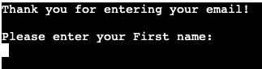

    * Invalid Email Errors: User is looped with `while True` and `if, elif, else` statements until email entered is validated by regex.

        

             

* **Collect First and Last name of user:** After entering valid email, they will be asked to enter their first name and then last name. The user input first letters will be capitalized for the next step by `.capitalize()` function.
    
    

    * **Errors in user name input:** User will be looped with `while True` and `if, elif, else` validation function until a valid string of input is entered by the user. If the user types _numbers, special characters, or enters empty string_ the errors will pop-up. User will be responded with what they typed and reason for error. Valid options will be displayed again and what must they do to get the valid option. 

        * First name errors' screenshots: 

            

            

            

        * Last name errors' screenshots:    

            

            

            

* **Book Information Stage:** At this stage, user will be asked to enter book title and author name. The input they enter will capitalize first letter of each word by `.title()` method.
    
    

    

    * The book name and author name could be anything. Therefore, the only error for an incorrect input would be an empty input.

        

        

* **Date Input:** User is first asked to enter start input for when they started reading or wish to start the book they have submitted. Format of date input is `YYYY-MM-DD`. Next, they will be asked to enter date of when they completed or wish to complete the book. This stage is reached once the book information stage is completed.
    * Start Date: 

        

    * End Date: If the start date is entered in correct Format, they will be asked to enter end date.

        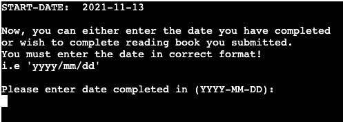

    * Valid Date: Once valid date is give, user will see their Start and End date

            

    * Date Errors: 
        * Date format function is condition with a ValueError. If date is not in the correct format or typed anything apart from date or left blank, ValueError is expected and user is asked again until correct format input is achieved.

            

            

        * Invalid Date: If the user enters an end-date which is before the start-date given, user will recieve an error message indicating what is wrong and what they must do to proceed. 

            

* **Worksheet update:** Once the user completes all the stages successfully, the details entered will be updated in the google sheet that is connected with the application API *(Steps of how to setup an API is explained in deployment section)* 

    

* **Automated email to user-mail:** Lastly, user will recieve an automated email from Reading-Recorder

    **NOTICE: Automated email is sent from Reading-Recorder based on the content user enters to the terminal. The automated email is sent to the email entered by the user. Therefore, it is the users responsibility to enter their own email addresses and correct data at all stages. Reading recorder forwards the user input, therefore has no responsibility to the content they enter at all stages(except the data is validated at certain stages. For example, you have to enter a valid email address, date in correct format as requested, etc.**     

    

### Future Features
* Add a user-log-in for security purposes for the user. This will also enable the user to keep a track of all the books they have read and be able to see the list of books they submitted. 

* For organized users, books can be divided in two categories. One for the books they have read. Second for the books they wish to read.

* Another feature that would be great to add is access to add and store PDF of books in whichever category they want to, so that they can access it easily from their mobile-phones or tablets.

## Data Model:
I have used functions and booleans for functioning of the program. `while True` loops the user until expected input is typed in the terminal. These loops are validated by other validate functions with `if, elif, else` statements.

* Here is a flowchart that explains how the program functions:
    
    

## [Testing](TESTING.md)
### Bugs
* Solved Bugs : Bugs explained in detail.
* Remaining Bugs: There are no remaining bugs

### Validator Testing
* PEP8:
    * No errors found in [PEP8](http://pep8online.com)
    * Some warnings found, and resolved by making changes requested. Details in [Testing](TESTING.md)

## Deployment
This project was deployed to [Heroku](https://www.heroku.com). "Heroku is a cloud platform that lets companies build, deliver, monitor and scale apps."- Heroku.

* Steps to open account in Heroku:
    * [Signup here](https://signup.heroku.com/) if you do not have an account already.

        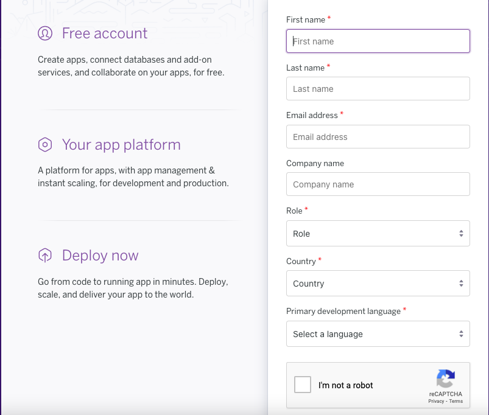

    * After you fill in all the information for account and sign in, you will be on [Dashbord](https://dashboard.heroku.com/apps). Here is where you will create an application. 
    * Click on New => Create new app.

        

    * Choose a name to your application and select location that you are based.

* Steps for deployment:
    * Add requirements.txt to the project for deployment.
    * Type `pip3 freeze > requirements.txt` in the terminal in Gitpod.
    * Create a new Heroku app (as explained above)
    * Name the app to "reading-recorder" and location as Europe.

        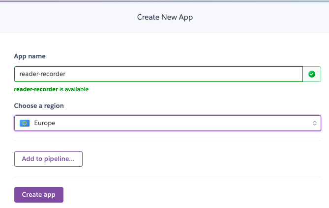 

    * In Settings add buildpacks in order _Python_ and _NodeJS_

        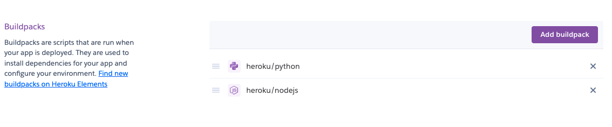 

    * In Settings add Config var (if any):
        * "Config vars change the way your app behaves. In addition to creating your own, some add-ons come with their own."
        * I have used config vars in my project in order to secure API credentials.

            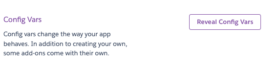 
            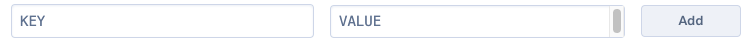 

    * In Deploy page, connect Github repository

        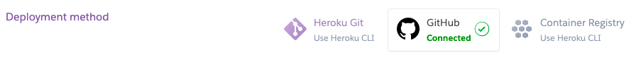

    * Connect project repository from your connected Github account

        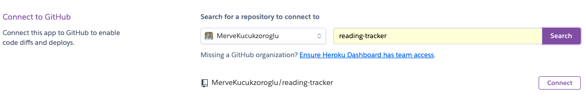

    * Manually deploy the project and choose the branch (main/master). Click on Deploy branch.

        

    * Once your app is deployed and ready, click on view to visit your deployed page.

        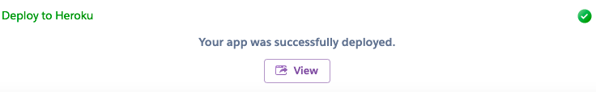

* **VIEW LIVE SITE [HERE](https://reading-recorder.herokuapp.com/)**

* How to setup API (Application Programming Interface) Google sheets with python:
    * Create a [Google Account](https://www.google.com/account/about/), if you dont have any.
    * Create [Google Sheets](https://www.google.com/sheets/about/).
    * Rename the title, add headings in first row

        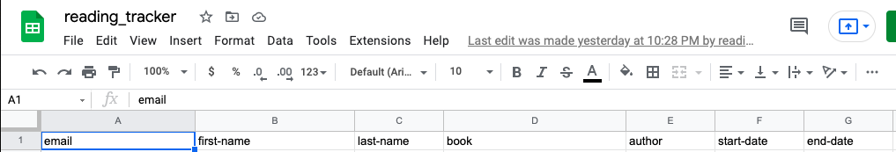

    * [Open Google Clouds](https://console.cloud.google.com/getting-started?pli=1).
    * From Select Project button, Select 'New Project'.
    * Choose a project name and click 'Create'.
        
        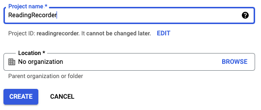

    * Click Select Project from dashbord notifications to go to project page.

        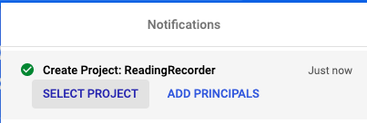

    *  From side menu: APIs & Services > Library.

        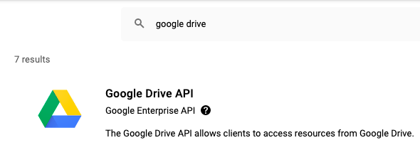
        
    * Search and select 'Google Drive'.

          

        * Click 'Enable' button.      
        * Create Google Drive Credentials. Click 'Create Credentials'.
        * Fill the form:
            * From the "Which API are you using?" dropdown menu, choose Google Drive API
            * For the "What data will you be accessing?" question, select Application Data
            * For the "Are you planning to use this API with Compute Engine, Kubernetes Engine, App Engine, or Cloud Functions?" question, select No, I'm not using them
            * Click Next
            * Enter a Service Account name, you can call it anything you like - I will call mine "LoveSandwiches" - then click Create
            * In the Role Dropdown box choose Basic > Editor then press Continue
            * These options can be left blank, click Done
            * On the next page, click on the Service Account that has been created
            * On the next page, click on the Keys tab
            * Click on the Add Key dropdown and select Create New Key
            * Select JSON and then click Create. This will trigger the json file with your API credentials in it to download to your machine. 

        * Go back to side menu: APIs & Services > Library.
        * Search and select 'Google Sheets'.
        * Click Enable. Google sheets don't require credentials.
    
    * Find the Google Drive, JSON credentials file in your computer and rename it to `creds.json`. Then add it to your gitpod workspace. 
    * Open creds.json and copy the client_email created.
    * Go back to Google sheet you created and click "SHARE" button. Paste the client email and click share.
    * In gitpod workspace add `creds.json` to `.gitignore` file to secure credentials.
    * Install gspread and google auth in gitpod workspace to access google sheets API:
        * Type `pip3 install gspread google-auth` to python terminal before starting to code. 
        * At top of python file, type:
            * ` import gspread`
            * `from google.oauth2.service_account import Credentials`

### Local Deployment

* _In order to make a local copy of this repository, you can type the following into your IDE terminal:_

    * `git clone hhttps://github.com/MerveKucukzoroglu/reading-tracker.git`

    Alternatively, if using Gitpod, you can click below to create your own workspace using this repository.

    

* _Local Deployment for raw python email code:_
    **NOTE** : I received errors sending emails at first, due to Google's security feature with **2-Factor Authentication**, **Less Secure Apps** disabled, and **DisplayUnlockCaptcha** disabled.

    **Plausible Fix** *(which has worked for me)*
    * Turn **Off** [2-Factor Authentication](https://myaccount.google.com/signinoptions/two-step-verification/enroll-welcome)
    * Turn **On** [Less Secure Apps](https://myaccount.google.com/lesssecureapps)
    * Turn **On** [DisplayUnlockCaptcha](https://accounts.google.com/DisplayUnlockCaptcha)

    I would recommend to create a secondary Google account for this purpose, instead of using your actual account (keep your actual account secure!). This is purely used for sending emails to the user once they submit a book, for better tracking purposes.

## Credits

* _Clear_ function credited to [GeekforGeeks](https://www.geeksforgeeks.org/clear-screen-python/):
    * `def clear():`
     `if name == "nt":`
       ` _ = system("cls")`
    `else:`
        `_ = system("clear")`

* _Email validation_ credits to:
    * [Wikipedia](https://en.wikipedia.org/wiki/Email_address) for `regex = r"^[a-zA-Z0-9._%+-]{1,64}@[a-zA-Z0-9.-]{3,252}\.[a-zA-Z]{2,}$"`.

* _Raw python to send email to the user_ :
    * Tim Nelson, Code Institute mentor to provide me with the raw python code, credentials, and how to make use of this code to send a direct email to user with the data they entered. I have edited the code as per my projects needs:
    * **Sending Emails using Python** :
        - [freeCodeCamp](https://www.freecodecamp.org/news/send-emails-using-code-4fcea9df63f/)
        - [StackOverflow](https://stackoverflow.com/a/17596848)
        - [StackOverflow](https://stackoverflow.com/q/16512592)
        - [StackOverflow](https://stackoverflow.com/a/8519646)    

* SCOPE code credits to Code Institute, Love Sandwiches Walkthrough Project. I have edited it according to my projects needs:

    * `SCOPE = ["https://www.googleapis.com/auth/spreadsheets", "https://www.googleapis.com/auth/drive.file", "https://www.googleapis.com/auth/drive"]`

    * `CREDS = Credentials.from_service_account_file('creds.json')
        SCOPED_CREDS = CREDS.with_scopes(SCOPE)
        GSPREAD_CLIENT = gspread.authorize(SCOPED_CREDS)
        SHEET = GSPREAD_CLIENT.open('reading_tracker')`       

* Date validation: In order to validate date format, I modified the [Kite code](https://www.kite.com/python/answers/how-to-validate-a-date-string-format-in-python) according to my requirement:

        `date_string = '12-25-2018'
        format = "%Y-%m-d"

        try:
            datetime.datetime.strptime(date_string, format)
            print("This is the correct date string format.")
        except ValueError:
            print("This is the incorrect date string format. It should be YYYY-MM-DD")`
