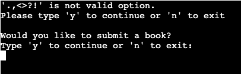

# Reading-Tracker
Reading Tracker is a reading recorder to keep a track on your readings.
This program aims to target the bookworms. It is a handy program to store details of the book you read. You can use this tracker both when you complete a book or when you wish to read the book. 
Reading tracker was also designed bearing in mind the busy schedules of our lives and hopes to motivate new readers. When you keep a track of your books, you will see the time frame of how long you took to complete the book. 

## How to use
The program function only when complete and valid data is entered by the user. The program loops at a particular step if the user does not enter a valid input. This is a useful way to only keep correct data entered by the user. [Please refer to existing features to view features in detail with screenshots of each step](#existing-eatures)

* User is asked to choose an option from menu to continue:
    1. Log a book
    2. About Reading-Tracker
* User is only allowed to proceed if they enter `1` or `2`.
* If they choose 2 they will see what Reding-Tracker is about.
* User is then asked to either proceed to _log a book_ or _exit_.
* _Exit_ option will take the user back to home page, which displays the menu.
* When the user chooses to proceed to _Log a book_ either from menu or from the about section of menu, they will begin submittinbg data  
* User is first asked to enter User name with first name and last name. 
* Next user is asked to enter a valid email address.
* After valid email, user will be asked to type and submit the title of book they wish to record.
* Next, name of the author will be collected from user.
* User will then be asked to enter start date of the book i.e _when started reading that book_. Then, user will enter date of when they have completed that book.
* Once the date is valid for both the date inputs in `dd/mm/yyyy` format; a complete data submitted will be displayed as the output to the user.

## Features
### [Existing Features](#existing-eatures)
 * **Home Page and Menu:** User is welcomed by the home page with menu. Menu is looped with `while True` and `if, elif, else` validation function until a valid input is entered by the user. The menu includes two options and user is only allowed to proceed if they enter `1` or `2`:
    1. Log a book
    2. About Reading-Tracker
        
        

    * **Menu Errors:** If the user types _random letters, random numbers, random special characters or enters empty string_ the error will pop-up. User will be responded with what they typed and reason for error. Menu will be displayed again and what must they do to get the valid option. 

        

         

        

             

* **About:** If user entered `2` they will see what Reding-Tracker is about. They will then be asked to enter either to continue or exit the about section. 

    

    * **About section Errors:** About section is looped with `while True` and `if, elif, else` validation function until a valid input is entered by the user. If the user types _random letters, random numbers, random special characters or enters empty string_ the error will pop-up. User will be responded with what they typed and reason for error. Valid options will be displayed again and what must they do to get the valid option. 

        

        

        

        

* **Exit from about**: If the user types `n` or `N`, they will exit the about and be directed back to home page with menu.

    

* **Log a book:** This step is reached either from Menu option `1` or by entering `y` or `Y` from about section of menu. When the user reaches this step, user will begin to follow steps to log a book. 

     

* **Collect First and Last name of user:** When the user is at the log a book step, they will be asked to enter their first name and then last name.
    
    

    * **Errors in user name input:** User will be looped with `while True` and `if, elif, else` validation function until a valid string of input is entered by the user. If the user types _numbers, special characters, or enters empty string_ the errors will pop-up. User will be responded with what they typed and reason for error. Valid options will be displayed again and what must they do to get the valid option. 

        * First name errors' screenshots: 

            

            

            

        * Last name errors' screenshots:    

            

            

            

* **Email step:** Once the user succeeds to enter valid name input, they will be at email stage. In this step user is asked to enter a valid email. Email is validated by `regex` described and credited in the credits section below. 

    

    If email entered is a valid email, then the outpul will display:
    
    

    * Invalid Email Errors: User is looped with `while True` and `if, elif, else` statements until email entered is validated by regex.

        

        

### Future Features

## Testing
### Bugs
* Solved Bugs
* Remaining Bugs

### Validator Testing
* PEP8:
    * test result

## Deployment
This project was deployed to Heroku.
* Steps for deployment:
    * Add requirements.txt to the project for deployment.
    * Type `pip3 freeze > requirements.txt` in the terminal.
    * Create a new Heroku app
    * Name the app to "reading-recorder" and location as Europe.
    * In settings add Config var and buildpacks in order _Python_ and _NodeJS_
    * In Deploy page, connect Github repository
    * Enable automatic deploys until the project is completed 
    * Click on __Deploy__

View the live site [here](https://reading-recorder.herokuapp.com/)

### Local Deployment

In order to make a local copy of this repository, you can type the following into your IDE terminal:

- `git clone hhttps://github.com/MerveKucukzoroglu/reading-tracker.git`

Alternatively, if using Gitpod, you can click below to create your own workspace using this repository.

## Credits

* _Clear_ function credited to [GeekforGeeks](https://www.geeksforgeeks.org/clear-screen-python/):
    * `def clear():`
     `if name == "nt":`
       ` _ = system("cls")`
    `else:`
        `_ = system("clear")`

* _Email validation_ credits to:
    * [Wikipedia](https://en.wikipedia.org/wiki/Email_address) for `regex = r"^[a-zA-Z0-9._%+-]{1,64}@[a-zA-Z0-9.-]{3,252}\.[a-zA-Z]{2,}$"`.
