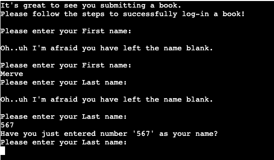
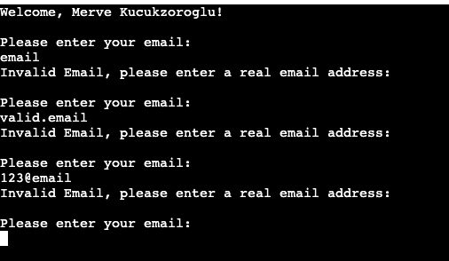

# Testing
## Bugs
### Solved Bugs
* Menu - About:
    * When user choses option '2. About' from Menu, to read about the application, a bug appeared. 
    * The about section in menu does not do anything when user chooses to read about it.
    * Add a function to direct the user to submit a book or else exit to the home page(Welcome and menu).
    Added the submit a book or exit functionality at this stage. Resolved the issue.
    * To follow the progress of this issue from Github issues, [click here](https://github.com/MerveKucukzoroglu/reading-tracker/issues/1)

* White lines and extra spaces warning in run.py:
    * Remove the warnings by running the code in PEP8 and resolve the issue.
    * Removed extra white trailing spaces.
    * Added 2 lines between functions.
    * Shortened or separated long sentences.
    * PEP8 validation resolved the issues.
    * To follow the progress of this issue from Github issues, [click here](https://github.com/MerveKucukzoroglu/reading-tracker/issues/2)

* Submit section clear() incorrect user input:
    * When the user enters wrong names in submit a book stage, the terminal gets full. clear the wrong input by clear function.

         

    * The above error is resolved by adding clear() function in validate username function.
    * To follow the progress of this issue from Github issues, [click here](https://github.com/MerveKucukzoroglu/reading-tracker/issues/3)

* Email input bug:
    * The terminal gets busy with invalid email inputs and must be cleared with clear function.

        

    * Terminal is cleared by clear function when an email input is invalid.   

         
         

    * When email is valid:    
       
        

    * To follow the progress of this issue from Github issues, [click here](https://github.com/MerveKucukzoroglu/reading-tracker/issues/4)   

### Remaining Bugs
* end_date should be >= start_date:
    * The start date of the book must be either on the same day or before the end date.
    * The bug is that the user can enter end date that is before start date...

    example:
    start_date = 2021-10-10
    end_date = 2010-11-11

    * To follow the progress of this issue from Github issues, [click here](https://github.com/MerveKucukzoroglu/reading-tracker/issues/5)

end date should be >= start_date
## Validator Testing
* PEP8:
    * test result